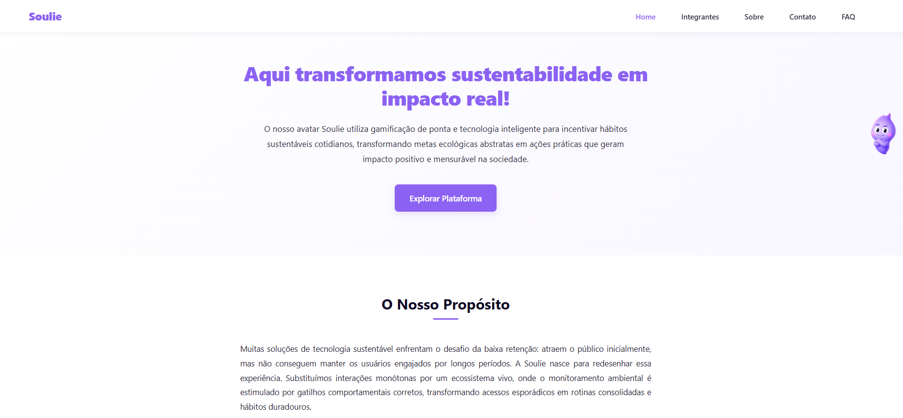
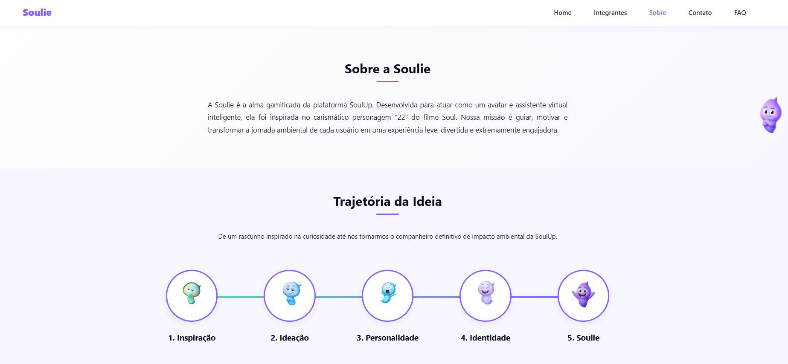
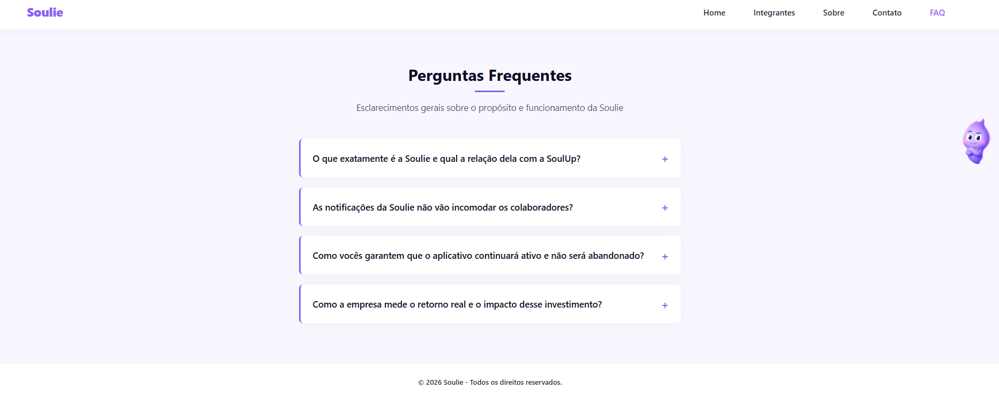
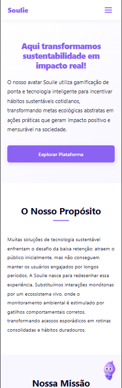
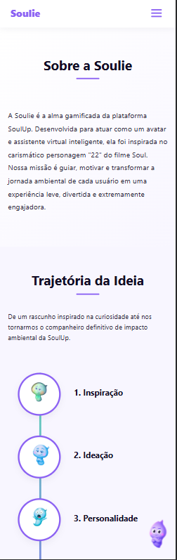

#  Soulie - A Alma Gamificada da SoulUp

##  Descrição do Projeto
A **Soulie** é a alma gamificada e a assistente virtual inteligente desenvolvida para a plataforma **SoulUp**. Inspirada na essência curiosa do personagem "22" do filme *Soul*, a Soulie nasceu com a missão de solucionar um dos maiores desafios do mercado de sustentabilidade: a retenção e o engajamento de usuários.

Através de uma abordagem comportamental baseada em pilares estratégicos, como sistemas de *streaks* (ofensivas diárias) inspirados no Duolingo, trilhas de evolução personalizadas, estímulos comunitários e notificações baseadas em inteligência de tempo , o ecossistema transforma a rotina de monitoramento ecológico em um hábito leve, voluntário, divertido e de impacto real.

---

## 🛠️ Tecnologias Utilizadas
O projeto foi desenvolvido utilizando tecnologias web nativas, prezando pela performance, sem dependências pesadas e com foco em boas práticas de componentização e semântica:

* **HTML5:** Estruturação semântica de layouts, seções institucionais e componentes de formulários.
* **CSS3:** Estilização avançada (Flexbox e CSS Grid para malhas responsivas), variáveis globais e responsividade mapeada em múltiplos breakpoints.
* **JavaScript:** Componentização modular e interatividade assíncrona para elementos dinâmicos da interface.

---


## 📸 Imagens e Representação do Projeto

Para ilustrar a jornada do usuário, a consistência da identidade visual e a engenharia de design responsivo do ecossistema **Soulie**, apresentamos abaixo as capturas de tela reais de todas as interfaces desenvolvidas na plataforma, cobrindo as experiências Desktop e Mobile:

### 🏠 1. Página Principal (Home - Desktop)
*A interface principal apresenta um design clean e moderno, estruturado com uma tipografia marcante em tons de roxo (`var(--primary-purple)`). A dobra traz uma chamada para ação (CTA) direta através do botão "Explorar Plataforma", além de introduzir a seção "O Nosso Propósito", que contextualiza o foco do ecossistema na retenção de usuários.*



### 📈 2. Página Institucional e Linha do Tempo (Sobre - Desktop)
*A página "Sobre" detalha a origem conceitual da assistente virtual baseada no filme Soul. Logo abaixo, a seção "Trajetória da Ideia" apresenta uma linha do tempo horizontal modular construída inteiramente em CSS, utilizando flexbox e máscaras circulares para exibir as cinco fases evolutivas do avatar com as suas respectivas expressões visuais e uma linha conectora com gradiente de cor suave.*



### 🧩 3. Central de Perguntas Frequentes (FAQ - Desktop)
*A página de FAQ organiza os principais esclarecimentos de negócio e operacionais de forma limpa através de componentes colapsáveis (Accordions). Estruturados de forma interativa via JavaScript, os blocos possuem uma borda lateral esquerda destacada com a cor da marca (`var(--primary-purple)`) e ícones de expansão, exibindo o conteúdo sob demanda para otimizar a carga cognitiva e a leitura do usuário.*



### 📱 4. Experiência Responsiva e Mobile (Home - Mobile)
*A versão para celular da página inicial demonstra a adaptabilidade completa do layout às telas menores. O cabeçalho fixa-se dinamicamente com a substituição do menu tradicional por um componente de Menu Hambúrguer interativo. A tipografia reorganiza-se de forma fluida e os botões de ação reajustam-se para ocupar a largura ideal da tela, mantendo a usabilidade e o conforto visual.*



### 📱 5. Engenharia de Responsividade (Sobre - Mobile)
*Demonstração da adaptação da trajetória institucional para dispositivos móveis. Através de media queries estratégicas, o roadmap transita de um fluxo horizontal para uma linha do tempo vertical centralizada. A engenharia do componente utiliza um pseudoelemento (`::before`) com gradiente linear de 180° para garantir a continuidade visual e a fluidez da leitura em telas estreitas, mantendo a hierarquia das etapas de evolução.*


---


## 👥 Autores e Créditos

Conheça os desenvolvedores responsáveis pela idealização e execução do ecossistema Soulie:

<table>
  <thead>
    <tr>
      <th>Nome do Integrante</th>
      <th>RM</th>
      <th>Turma</th>
      <th>LinkedIn</th>
      <th>GitHub</th>
    </tr>
  </thead>
  <tbody>
    <tr>
      <td>Arthur Carvalho Brito Martins</td>
      <td>RM 572325</td>
      <td>1TDSPH</td>
      <td><a href="https://www.linkedin.com/in/arthur-martinss/">LinkedIn</a></td>
      <td><a href="https://github.com/arthurmartinss">GitHub</a></td>
    </tr>
    <tr>
      <td>Diego Soares Trujillo</td>
      <td>RM 570147</td>
      <td>1TDSPH</td>
      <td><a href="https://www.linkedin.com/in/diego-trujillo-3441b9380/">LinkedIn</a></td>
      <td><a href="https://github.com/diegotrujillo011">GitHub</a></td>
    </tr>
    <tr>
      <td>Enzo Nukui da Silva</td>
      <td>RM 569770</td>
      <td>1TDSPH</td>
      <td><a href="https://www.linkedin.com/in/enzo-nukui/">LinkedIn</a></td>
      <td><a href="https://github.com/EnzoNukui">GitHub</a></td>
    </tr>
    <tr>
      <td>Leticia Cardoso de Almeida</td>
      <td>RM 569415</td>
      <td>1TDSPH</td>
      <td><a href="https://www.linkedin.com/in/let%C3%ADcia-almeida-70b851294/">LinkedIn</a></td>
      <td><a href="https://github.com/lehalmeidafc0">GitHub</a></td>
    </tr>
    <tr>
      <td>Leticia Dias Araujo Felix Moratori</td>
      <td>RM 569138</td>
      <td>1TDSPH</td>
      <td><a href="https://www.linkedin.com/in/leticia-felix-660253286">LinkedIn</a></td>
      <td><a href="https://github.com/LeticiaFelix18">GitHub</a></td>
    </tr>
  </tbody>
</table>

## 🔗 Repositório

[](https://github.com/EnzoNukui/soulie) [https://github.com/EnzoNukui/soulie](https://github.com/EnzoNukui/soulie)

## 📁 Estrutura de Pastas do Projeto
A arquitetura do repositório segue rigorosamente a organização de arquivos do ambiente de desenvolvimento:

```text
📂 soulie/
├── 📂 css/
│   ├── avatar.css            # Estilos específicos do mascote persistente
│   ├── base.css              # Regras base, resets e tipografia
│   ├── contato.css           # Estilização da página de suporte
│   ├── faq.css               # Design da seção de dúvidas frequentes
│   ├── footer.css            # Estilos do rodapé global
│   ├── index.css             # Estilos específicos da página Home
│   ├── integrante.css        # Layout da página de apresentação da equipe
│   ├── main.css              # Variáveis globais e configurações de reset
│   ├── menu.css              # Estilização do cabeçalho e menu de navegação
│   └── sobre.css             # Estilos da página institucional e linha do tempo
├── 📂 imagens/
│   ├── 📂 avatar/            # Estados, expressões e evolução da Soulie
│   ├── 📂 favicon/           # Ícones de inicialização do navegador
│   └── 📂 imagens_integrantes/ # Fotos e recursos visuais da equipe
│   └── 📂 apres_proj/          # Fotos apresentação projeto
├── 📂 js/
│   ├── contato.js            # Validações do formulário de contato
│   ├── faq.js                # Comportamento dos accordions de dúvidas
│   ├── main.js               # Script principal e inicializador
│   └── menu.js               # Lógica de abertura/fechamento do menu responsivo
├── 📂 paginas/
│   ├── contato.html          # Tela de comunicação e suporte
│   ├── faq.html              # Central de perguntas frequentes
│   ├── integrante.html       # Apresentação dos desenvolvedores
│   └── sobre.html            # Detalhemento e trajetória da solução
├── index.html                # Página principal (Home) do ecossistema
└── readme.md                 # Guia técnico e informativo do projeto
```
---

## ✉️ Contato e Suporte

Para garantir a transparência, o reporte de melhorias e o esclarecimento de dúvidas sobre o ecossistema **Soulie**, a equipe disponibiliza os seguintes canais oficiais de comunicação:

* 🐛 **Reporte de Bugs e Sugestões (Via GitHub):** Caso encontre alguma falha de responsividade, renderização ou queira sugerir melhorias técnicas, abra uma sinalização diretamente na nossa aba de [GitHub Issues](https://github.com/EnzoNukui/soulie/issues). É a forma mais rápida de interagir com o time de desenvolvimento.
* ✉️ **Contato Direto com a Equipe:** Para qualquer dúvida geral, feedback sobre a solução ou outras informações sobre o projeto, você pode falar diretamente com um de nossos desenvolvedores responsáveis através do e-mail: [rm572325@fiap.com.br](mailto:rm572325@fiap.com.br).


